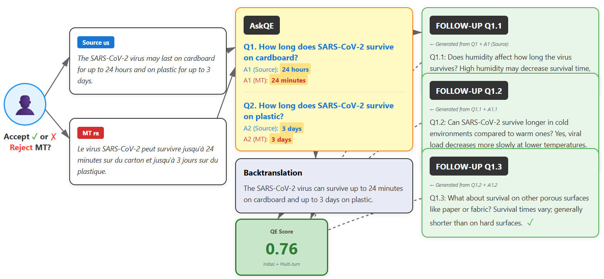

# ASKQE-MULTITURN  
## Multi-Turn QA-Based Framework for Machine Translation Evaluation in the Biomedical Domain

### Description

ASKQE-MULTITURN is a framework for evaluating machine translation quality through structured multi-turn question–answer interactions. Inspired by the AskQE paradigm (Ki, Duh and Carpuat), the system reformulates translation evaluation as an iterative QA process, where semantic consistency between source and translated texts is progressively probed through follow-up questions.

Instead of relying solely on reference-based metrics, the framework leverages multi-turn Question Generation (QG) and Question Answering (QA) to iteratively probe semantic consistency between the source and the translated text. Through successive follow-up questions conditioned on previous answers, the system progressively explores deeper layers of meaning, contextual dependencies, and domain-specific information. This multi-turn structure enables a more comprehensive evaluation of translation adequacy, making it particularly suitable for high-stakes domains such as biomedical translation, where preserving semantic fidelity across contextual interactions is critical.



---

## Core Idea

The framework evaluates translation quality through dialogue-driven semantic verification:

1. Generate initial questions from the source text.
2. Answer those questions using both the source and the translated text.
3. Generate follow-up questions conditioned on previous QA pairs.
4. Compare answers across turns to detect semantic divergence.
5. Aggregate lexical and semantic metrics to estimate translation quality.

The multi-turn structure enables deeper semantic probing than single-turn QA-based evaluation and increases sensitivity to subtle translation errors.

---

## Key Features

- **Multi-Turn QA-Based Evaluation**  
  Iteratively probes semantic consistency between source and translated texts through structured follow-up questions.

- **Question Generation (QG)**  
  Automatically generates initial and follow-up questions from source texts.

- **Question Answering (QA)**  
  Produces answers from both source and translated texts to measure alignment.

- **Semantic Scoring**  
  Computes lexical and semantic metrics (e.g., F1, ChrF, BLEU, SBERT similarity) across multiple turns.

- **Perturbation-Based Stress Testing**  
  Applies controlled translation perturbations to evaluate robustness and error sensitivity.

- **Biomedical Domain Adaptation**  
  Designed for biomedical corpora, ensuring terminology-aware semantic evaluation.

- **Reference-Free Capability**  
  Enables translation quality estimation without requiring human reference translations.
  
- **Multilingual Adaptability**
Suitable for multiple languages, thanks to back-translation (BT) methods. Specifically, it analyzes translations between English and Italian, Spanish, and French.

---

## Contribution

ASKQE-MULTITURN extends the original AskQE framework by introducing iterative multi-turn QA interactions, allowing deeper semantic probing and improved detection of meaning distortions in specialized domains such as biomedical translation.

## Project Structure

```
ASKQE-MULTITURN/
├── biomqmGeneration/   # Module for biomedical dataset generation (from BioMQM)
├── evaluation/         # Scripts and tools for evaluation
├── results/            # Experiment results
├── multiturn.py        # Multi-turn conversation management
├── qg.py               # Question Generation
├── qa.py               # Question Answering
├── perturb.py          # Text perturbation
├── translate.py        # Translation
├── backtranslate.py    # Back-translation
├── generateFile.py     # Module for biomedical dataset generation (from PubMed)
├── prompt.json         # Prompt templates and configurations
└── README.md           # This file
```


## Usage

### Data Generation

The `biomqmGeneration` module is specialized for creating datasets in the biomedical domain starting from BioMQM dataset. 
For more details, consult the specific documentation in the folder.

```python
python biomqmGeneration/biomqmGeneration.py <mtcarousel_file> <reference_file1> <reference_file2> <output_file>
```

The `generateFile` script is specialized for creating datasets from PubMed abstracts. 
For more details, consult the specific documentation in the file.

```python
python generateFile.py
```

### Translation

```python
python translate.py --input_path <input_file> --output_path <output_file> --source_lang <source_language> --target_lang <target_language>
```


### Perturbation

```python
python perturb.py --input_path <input_file> --output_path <output_file> ...prompt_path <prompt_file> --prompt_key <perturbationType>
```
where perturbationType in this study can be "perturb_expansion_impact", "perturb_omission" and "perturb_alteration".


### Back-translation

```python
python backtranslate.py --input_path <input_file> --output_path <output_file> --source_lang <source_language> --target_lang <target_language>
```

### Question Generation

```python
python -u qg.py  --input_path <input_file> --output_path <output_file> ...prompt_path <prompt_file> --prompt_key <qg_prompt>
```

### Question Answering

```python
python -u qa.py --input_path <input_file> --output_path <output_file> ...prompt_path <prompt_file> --prompt_key <qa_prompt>
```

### Multi-turn Conversations

```python
python multiturn.py  --input_path <input_file> --output_path <output_file> --prompt_path <prompt_file> --max_turns <numberOfTurns(3)>
```


## Evaluation


The evaluation scripts are designed to process and assess the quality of translations through multiple steps and metrics. Below is a description of the key scripts and their functionality:

### evaluation/annotation_rule.py
This script is similar to the original annotation rule file, but it has been modified to accommodate nested lists, allowing for multiple severity levels. If errors are marked with a severity of "Critical" or "Major," the translation is rejected; otherwise, it is accepted.

### evaluation/gmm.py
This script first calculates the average value of the chosen metric across all 5–6 generated responses. The Gaussian Mixture Model (GMM) then attempts to fit two distributions: one with a lower mean (representing low quality) and one with a higher mean (representing high quality). The average of the two centroids is taken as the threshold to decide whether the translation should be accepted or rejected, based on the average metric value.

### evaluation/compare.py
This script is similar to the original comparison file. It compares the files generated by `annotation_rule.py` and `gmm.py`, checking how often the same translations are accepted or rejected. The results are evaluated using precision, recall, and a confusion matrix.

### evaluation/finalResultGeneration.py
This script performs similarity calculations in multiple stages: first between the follow-up question and the original question, then between the follow-up question and the original question's answer, comparing both back-translated (BT) and source (SRC) answers. The first two similarities are averaged and then combined with another metric in a 30/70 ratio. The final output includes a similarity score for each question and turn. The scores from all turns are averaged and then combined with the original scores from the first responses. This process is repeated for all metrics.

### evaluation/multiTurnEvaluation.py
This script calculates all metrics for every question and turn, and its output is used in `finalResultGeneration.py`.

### evaluation/scoreGeneration.py
This script functions similarly to `multiTurnEvaluation.py` but operates on the original setup without multi-turn evaluation.

### evaluation/sbert.py and evaluation/stringcomparison.py
These scripts generate a CSV file containing the average cosine similarity values between `answer_src` and `answer_bt` for all questions and IDs, divided by language and perturbation. While `sbert.py` focuses on calculating cosine similarity, `stringcomparison.py` extends this by calculating the four usual metrics for string comparison: F1, BLEU, ChrF, and EM. 


## `results` folder
Contains results divided by language, perturbation, and the BioMQM dataset.

- **`scoreOriginal.jsonl`**: Standard results based on the first responses and questions.
- **`results_multiturn.jsonl`**: Results from `multiTurnEvaluation.py`, containing three metrics for each turn and question.
- **`final_results.jsonl`**: The final output from `finalResultGeneration.py`, which combines `scoreOriginal.jsonl` and `results_multiturn.jsonl`.


