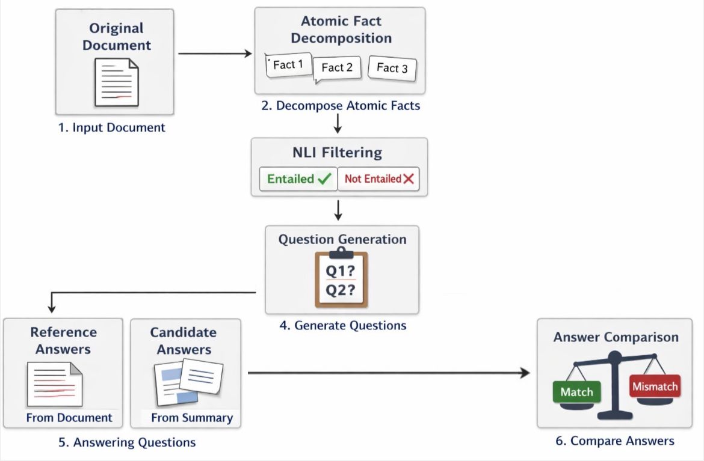

# AskQE-Summarization

Adaptation of the AskQE framework to the task of summarization, rather than machine translation. This repository provides scripts to:
- generate abstractive summaries for PubMed articles,
- extract atomic facts from documents,
- filter facts via NLI models,
- generate questions from facts,
- run question-answering to evaluate whether summaries retain key facts.

Purpose: evaluate whether key facts in source documents are preserved in generated summaries.

!


## Dataset

We use a subset of the```ccdv/pubmed-summarization``` dataset.

Each instance originally contains:

- article: full paper body

- abstract: gold summary

Processing full-length biomedical articles would require document segmentation, which may introduce fact-question misalignment. We therefore restrict the input to the first 800 tokens to maintain contextual coherence. Summaries are generated from this truncated input to ensure alignment between source and summary, avoiding comparison against gold abstracts that may contain not present information. 

## Models Used

Summarization: ```sshleifer/distilbart-cnn-12-6```

Atomic Fact Extraction / QG / QA: ```Qwen2.5-3B-Instruct```

NLI Filtering: ```roberta-large-mnli```

Semantic Similarity: ```sentence-transformers/all-MiniLM-L6-v2```

## Structure
### Project Structure
```
Beyond-AskQE/AskQE-Summarization
├── atomic_facts/          # Atomic fact extraction from source documents
├── NLI/                   # NLI filtering of atomic facts
├── QG/                    # Question Generation from filtered facts
├── QA/                    # Question Answering over sources and summaries
├── evaluation/            # Lexical and semantic evaluation
├── data/                  # Input articles and generated summaries
├── requirements.txt       # Python dependencies
└── README.md              # Project documentation
```
### PubMed Summarization with DistilBART
This script generates abstractive summaries for PubMed articles using `sshleifer/distilbart-cnn-12-6`.

Clone repository and install dependencies:
```bash
!git clone https://github.com/AlessiaCicca/Beyond-AskQE.git
cd Beyond-AskQE/AskQE-for-summarization
!pip install -r requirements.txt
```
Usage:
```bash
python data/summaries.py \
  --input data/pubmed_articles.json \
  --output data/summaries.jsonl
```
### Fact extraction
```bash
python atomic_facts/atomic_facts.py \
  --input data/pubmed_articles.json \
  --output atomic_facts/pubmed_atomic_facts.jsonl
```
### NLI filtering
```bash
python NLI/nli_filtering.py \
  --pubmed data/pubmed_articles.json \
  --atomic_facts atomic_facts/pubmed_atomic_facts.jsonl \
  --output NLI/pubmed_facts_entailed.jsonl
```
### Question Generation
```bash
python QG/generate_questions.py \
  --input NLI/pubmed_facts_entailed.jsonl \
  --output QG/pubmed_questions_generated.jsonl
```
### Question Answering
```bash
python QA/question_answering.py \
  --pubmed data/pubmed_articles.json \
  --summaries data/summaries.jsonl \
  --questions QG/pubmed_questions_generated.jsonl \
  --output QA/pubmed_answers.jsonl
```
### Evaluation
#### Lexical metrics
```bash
python evaluation/string_comparison.py \
  --input QA/pubmed_answers.jsonl \
  --output evaluation/pubmed_string_metrics.jsonl
```
#### Semantic similarity (SBERT)
```bash
python evaluation/sbert.py \
  --input QA/pubmed_answers.jsonl \
  --output evaluation/pubmed_sbert.jsonl
```
